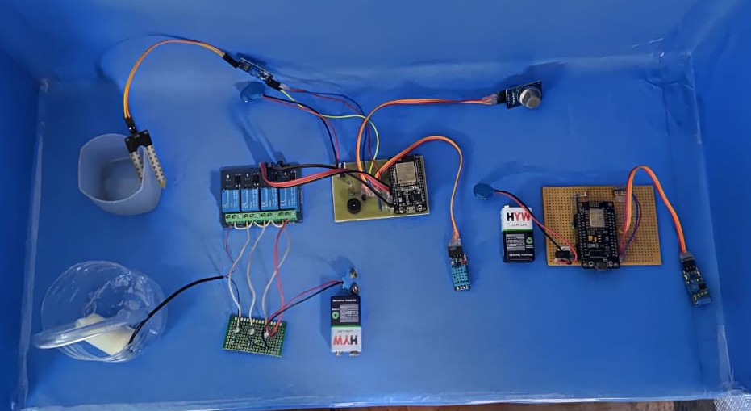

# Smart Home Automation with ESP32 & ESP8266

## Table of Contents
- [Overview](#overview)
- [Image](#image)
- [Features](#features)
- [System Architecture](#system-architecture)
- [Hardware Requirements](#hardware-requirements)
- [Software & Libraries](#software--libraries)
- [Setup & Installation](#setup--installation)
- [Wiring Guide](#wiring-guide)
- [How to Use](#how-to-use)
- [Notes](#notes)
- [License](#license)

## Overview

This project is a comprehensive DIY Smart Home Automation system using an ESP32 as the central controller (Parent) and an ESP8266 as a specialized sensor node (Child). The system allows you to monitor various environmental sensors and control home appliances remotely through a web-based dashboard. It also integrates with external APIs to fetch real-time weather data.

The core of the system is the **Parent (ESP32)**, which hosts a web server and a WebSocket server. This allows for real-time, two-way communication with a web dashboard accessible from any device on the same local network. It gathers data from a suite of sensors, including temperature, humidity, gas levels, light intensity, and soil moisture. Based on this data, it can automatically control devices like a fan, lights, and a water pump, or be controlled manually through the dashboard.

The **Child (ESP8266)** node is designed to be placed in a specific location to handle discrete tasks. In this implementation, it monitors for vibrations (to detect if a laundry machine is running) and uses a laser and LDR to create a tripwire-style security sensor. It then sends status updates to the Parent node over HTTP.

## Image

## Features

-   **Web-Based Dashboard**: Access a sleek, modern dashboard from your browser to monitor and control your home.
-   **Real-Time Communication**: Utilizes WebSockets for instant updates on the dashboard without needing to refresh the page.
-   **Sensor Monitoring**:
    -   Temperature & Humidity (DHT11)
    -   Heat Index Calculation
    -   Gas Leak Detection (MQ-2 or similar) with buzzer alarm
    -   Ambient Light Intensity (LDR)
    -   Soil Moisture
-   **Appliance Control**:
    -   Fan, Light, Water Pump, and Geyser control.
    -   Manual ON/OFF toggles from the dashboard.
    -   On-time tracking for each appliance.
-   **Automation & Logic**:
    -   **Automatic Fan Control**: Activates the fan based on temperature and humidity thresholds.
    -   **Automatic Light Control**: Turns lights on/off based on ambient light levels.
    -   **Automatic Watering System**: Runs a water pump when soil moisture is low.
    -   **Hysteresis**: Implements hysteresis for all thresholds to prevent rapid, unnecessary switching of appliances.
-   **External Data Integration**:
    -   Fetches current outdoor temperature, humidity, and Air Quality Index (AQI) from the **OpenWeatherMap API**.
-   **Timed Operations**:
    -   Set custom start and stop times for the light and motor.
-   **Distributed Sensing (Parent-Child Architecture)**:
    -   **Laundry Monitoring**: The Child node detects washing machine vibrations and reports the status (running/idle) to the Parent.
    -   **Security System**: A laser tripwire on the Child node detects security breaches and alerts the Parent.
-   **Local Network Discovery**: Uses mDNS to make the dashboard easily accessible at `http://homeconnect.local`.

## System Architecture

The project employs a parent-child (or master-slave) architecture:

1.  **Parent (ESP32)**: This is the brain of the operation.
    -   It connects to your local WiFi network.
    -   It hosts the web server that delivers the HTML/CSS/JavaScript for the user interface.
    -   It runs a WebSocket server to handle real-time data exchange with the web clients.
    -   It directly manages the sensors and relays connected to its pins.
    -   It listens for HTTP requests from the Child node to receive updates about laundry and security status.

2.  **Child (ESP8266)**: This is a satellite node with a specific purpose.
    -   It also connects to the same WiFi network.
    -   It monitors its dedicated sensors (vibration sensor, laser tripwire).
    -   When a change in status is detected (e.g., laundry starts, security is breached), it sends an HTTP GET request to the Parent's server (e.g., `http://homeconnect.local/update?laundry=1`).

This architecture is modular and scalable, allowing you to add more Child nodes in the future to monitor different parts of your home without overloading the Parent controller.

## Hardware Requirements

### Parent Node (ESP32)

-   ESP32 Development Board
-   DHT11 Temperature and Humidity Sensor
-   MQ series Gas Sensor (e.g., MQ-2)
-   Photoresistor (LDR)
-   Soil Moisture Sensor
-   Buzzer
-   4-Channel Relay Module
-   Appliances to control (Fan, Light Bulb, Water Pump, Geyser)
-   Breadboard and Jumper Wires

### Child Node (ESP8266)

-   ESP8266 Development Board (e.g., NodeMCU)
-   Vibration Sensor Module (e.g., SW-420)
-   Laser Diode Module
-   A separate LDR (for the tripwire)
-   Resistors as needed
-   Breadboard and Jumper Wires

## Software & Libraries

1.  **Arduino IDE**: To program the ESP32 and ESP8266 boards.
2.  **Board Support**:
    -   `esp32` by Espressif Systems
    -   `esp8266` by ESP8266 Community

### Parent (ESP32) Libraries

-   `<WiFi.h>`
-   `<WebServer.h>`
-   `<WebSocketsServer.h>`
-   `<ESPmDNS.h>`
-   `<HTTPClient.h>`
-   `<Arduino_JSON.h>`
-   `<DHT.h>`

### Child (ESP8266) Libraries

-   `<Arduino.h>`
-   `<ESP8266WiFi.h>`
-   `<ESP8266HTTPClient.h>`
-   `<WiFiClient.h>`

You can install these libraries through the Arduino IDE's Library Manager.

## Setup & Installation

1.  **Hardware Setup**:
    -   Wire the sensors and relay modules to the ESP32 and ESP8266 as defined by the pin numbers in the code. See the **Wiring Guide** section below.

2.  **API Key**:
    -   Go to [OpenWeatherMap](https://openweathermap.org/) and create a free account.
    -   Get your API key.
    -   In `Smart_Home_Automation_Parent.ino`, replace `"YOUR_API_KEY"` with your actual key in the `openWeatherMapApiKey` variable.

3.  **Code Configuration**:
    -   Open both `.ino` files in the Arduino IDE.
    -   In both files, update the `ssid` and `password` variables with your WiFi credentials.
    -   In `Smart_Home_Automation_Parent.ino`, you can change the `city` and `countryCode` for weather data.

4.  **Flashing the Code**:
    -   **Parent**: Connect your ESP32 to your computer. Select the correct board and COM port in the Arduino IDE and upload `Smart_Home_Automation_Parent.ino`.
    -   **Child**: Connect your ESP8266. Select the correct board and COM port and upload `Smart_Home_Automation_Child.ino`.

5.  **Running the System**:
    -   Power on both devices.
    -   Open the Serial Monitor for both to check for successful WiFi connection and to see their IP addresses.
    -   Open a web browser on a device connected to the same WiFi network and navigate to `http://homeconnect.local` or the IP address of the ESP32.

## Wiring Guide

### Parent (ESP32)

| Component             | ESP32 Pin      |
| --------------------- | -------------- |
| DHT11 Sensor          | GPIO 32        |
| Gas Sensor (Analog)   | GPIO 34        |
| Buzzer                | GPIO 33        |
| LDR (Analog)          | GPIO 39        |
| Soil Moisture (Analog)| GPIO 35        |
| **Relay Module**      |                |
| Relay 1 (Fan)         | GPIO 25        |
| Relay 2 (Light)       | GPIO 26        |
| Relay 3 (Motor)       | GPIO 14        |
| Relay 4 (Geyser)      | GPIO 27        |

### Child (ESP8266)

| Component                     | ESP8266 Pin (NodeMCU) |
| ----------------------------- | --------------------- |
| Vibration Sensor (Digital Out)| D1                    |
| Laser Security LDR (Analog)   | A0                    |

**Note**: Ensure all components are powered with the correct voltage (3.3V or 5V) and that grounds are connected.

## How to Use

-   **Dashboard**: The main screen gives you a complete overview of all sensor readings and device statuses.
-   **Sensor Readings**: Monitor real-time data from all connected sensors. The Gas, Security, and Laundry statuses will change color and text to alert you of important events.
-   **Thresholds**: Use the sliders to adjust the trigger points for automatic control of the fan, lights, and water pump.
-   **Controls**: Manually toggle any connected appliance on or off using the switches.
-   **Timers**: Click "Set Timer" for the light or motor to open a popup where you can define a specific time window for the device to be active.

## Notes

- The system automatically reconnects to WiFi if the connection is lost
- Sensor data is updated every second
- All devices communicate through a WebSocket server (port 81)
- Web interface updates are optimized for performance and responsiveness

## License
This project is licensed under the MIT License. See the [LICENSE](LICENSE) file for details.
